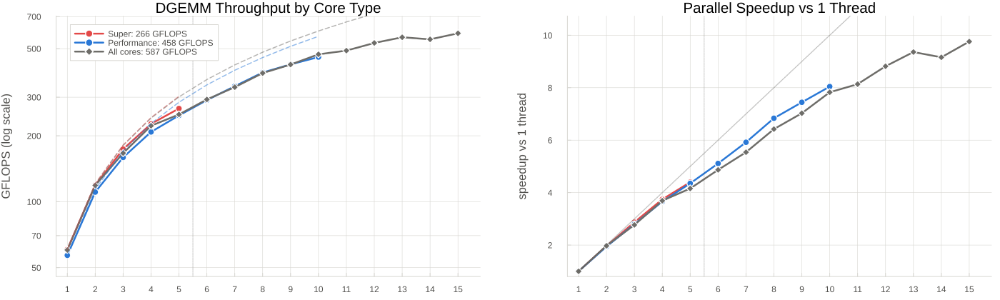

# OpenBLAS DGEMM scaling across Apple silicon core tiers

Measures how OpenBLAS DGEMM throughput scales with thread count on each core
tier of an Apple M-series chip, and across the whole machine, to inform the
default BLAS thread count in LinearAlgebra.jl
([JuliaLang/LinearAlgebra.jl#1686](https://github.com/JuliaLang/LinearAlgebra.jl/pull/1686)).

Apple chips expose their cores as ordered performance levels (`hw.nperflevels`):

| Chips | Levels reported by macOS |
|---|---|
| M1 to M4 | Performance + Efficiency |
| M5 Pro / M5 Max | Super + Performance (no Efficiency cores) |
| M6 (announced) | three tiers |

OpenBLAS splits each GEMM statically across its threads, so one call is only as
fast as its slowest thread. Whether a slower tier should be included in the
default thread count depends on how fast its cores are relative to the top tier,
which is what this package measures.

## Current results: Apple M5 Pro

5 Super cores (one cluster) + 10 Performance cores (two clusters of 5),
macOS 26.6, Julia 1.12.7, DGEMM 2048×2048 Float64, best of 5 trials.



| Threads | Super only | Performance only | All cores |
|--:|--:|--:|--:|
| 1 | 60.6 | 56.9 | 60.2 |
| 2 | 119.1 | 110.6 | 118.7 |
| 3 | 173.9 | 159.3 | 166.7 |
| 4 | 226.6 | 208.2 | 222.2 |
| 5 | **266.4** | 247.6 | 250.2 |
| 6 | | 290.9 | 293.0 |
| 7 | | 336.9 | 333.5 |
| 8 | | 389.0 | 386.5 |
| 9 | | 423.6 | 423.0 |
| 10 | | **457.7** | 471.1 |
| 11 | | | 489.7 |
| 12 | | | 530.7 |
| 13 | | | 563.4 |
| 14 | | | 551.3 |
| 15 | | | **587.4** |

The 13 to 15 thread region is where the default gets decided and it is noisy at
5 trials, so it was re-measured with 15 trials, twice:

| Threads | best | median |
|--:|--:|--:|
| 13 | 587, 582 | 577, 574 |
| 14 | 632, 634 | 619, 613 |
| 15 | 641, 621 | 545, 584 |

**Observations**

1. A Performance core is 94% of a Super core for DGEMM (56.9 vs 60.6 GFLOPS).
   They are not efficiency cores in the M1 sense.
2. Both tiers scale well in isolation: 4.4× on 5 Super cores, 8.0× on 10
   Performance cores (across both clusters).
3. Using the whole machine pays: 15 threads gives 2.2× the throughput of the
   Super tier alone. Normal-QoS threads fill the Super cores first, so the
   all-cores curve follows the Super curve to 5 threads and then keeps climbing
   at roughly one Performance core per thread.
4. 14 threads (total minus one) was within run-to-run variation of 15 on best
   throughput and had the higher medians, so leaving one core free costs
   nothing here.

**Implication for #1686:** on a chip with no Efficiency cores, restricting BLAS to
the top tier would forfeit more than half the available DGEMM throughput. The
PR's rule for this case, all cores minus one, lands within noise of the best
measured setting.

### Earlier results: Apple M1 and M1 Pro (previous method, see caveat)

| Threads | M1 P-cores | M1 E-cores | M1 Pro P-cores | M1 Pro E-cores |
|--:|--:|--:|--:|--:|
| 1 | 48.3 | 7.7 | 46.4 | 6.4 |
| 2 | 94.0 | 14.6 | 92.6 | 12.3 |
| 3 | 132.2 | 19.5 | 135.3 | |
| 4 | 174.8 | 22.4 | 182.0 | |
| 6 | | | 241.5 | |
| 8 | | | 319.0 | |

Caveat: the E-core rows were measured with the previous isolation method,
background QoS (`taskpolicy -b`). On the M5 Pro that method confined the
process to a single cluster of the lowest tier and ran it at roughly a third of
its normal-QoS speed (20.7 GFLOPS per Performance core instead of 56.9, and a
plateau at 5 threads instead of scaling to 10), so treat these E-core numbers as
lower bounds. Even allowing a similar correction, an M1 E-core stays well under
half a P-core, so with static partitioning adding E-core threads lengthens the
call and excluding Efficiency cores remains the right default there. This should
be confirmed by re-running the current sweep (which adds the `all` mode) on an
M1 to M4 machine; the P-core rows are unaffected by the change.

### Multi-chip comparison


Panels are per level name as macOS reports it. Note that "Performance" is the
top tier on M1 to M4 but the second tier on M5 Pro / M5 Max.

## How placement works

macOS has no thread-affinity API, so nothing can be pinned to a cluster. What
the scheduler does give us: normal-QoS threads are placed on the fastest idle
cores first and spill to slower tiers only when the faster ones are busy.

| Mode | Threads | Occupier | Where the benchmark runs |
|---|---|---|---|
| top tier (`super` on M5 Pro, `performance` on M1 to M4) | 1 to tier cores | none | the fastest cores |
| lower tiers (`performance` on M5 Pro, `efficiency` on M1 to M4) | 1 to tier cores | one spinner per faster core | the tier under test |
| `all` | 1 to total cores | none | wherever the scheduler puts `BLAS.set_num_threads(n)` |

The **occupier** (`src/occupier.jl`) is a separate Julia process with one thread
per faster core, each set to user-interactive QoS with
`pthread_set_qos_class_self_np` and spinning. The scheduler keeps those on the
fastest cores, so the benchmark process, launched at normal QoS while they spin,
lands on the tier under test at that tier's normal clocks. The occupier stops
when the sweep closes its stdin, so it never needs a signal (a SIGTERM would
leave the spinning threads stuck). On the M5 Pro the 1-thread Performance result
under this scheme is 57 GFLOPS against 61 on a Super core, and scaling is linear
across both Performance clusters, which is the expected behaviour of ten
near-P-class cores.

Why not background QoS (the previous method)? `taskpolicy -b` does confine a
process to the lowest tier, but on the M5 Pro it confined it to *one* 5-core
cluster (two concurrent background processes shared 74 GFLOPS between them, the
same as one alone) and ran the cores at about a third of their normal-QoS
throughput. Utility QoS (`taskpolicy -c utility`) is not confined at all. And
neither can isolate a middle tier on a three-tier chip.

Each measurement point runs in a **fresh process** (its own OpenBLAS thread pool,
with both `OPENBLAS_NUM_THREADS` and `BLAS.set_num_threads` set), so no leftover
threads from a previous point interfere. A 512×512 warm-up absorbs thread
creation and migration onto the target cores before timing starts.

## Usage

```bash
# Sweep this chip (all modes), write results.csv and dgemm_cores.png/svg
julia --project=. driver.jl

# Keep a named copy for collation, with more trials in the decision region
julia --project=. driver.jl --out=results-m5pro.csv --trials=15

# Only some modes
julia --project=. driver.jl --modes=super,all

# Compare across chips
julia --project=. collate_results.jl results-m1.csv results-m1pro.csv results-m5pro.csv

# One level only
julia --project=. collate_results.jl results-*.csv --level=All
```

The scripts are thin wrappers around the `AppleMSeriesBLASCoreComparison`
package, so everything is also available as function calls:

```julia
using AppleMSeriesBLASCoreComparison

sweep(n=2048, trials=15, out="results-m5pro.csv")   # run the sweep (+ plot)
plot_results("results-m5pro.csv"; outbase="dgemm_cores_m5pro")
collate_results(["results-m1.csv", "results-m5pro.csv"]; level="Performance")
```

`plot_results` also prints the all-cores throughput at each candidate default
(top tier only, total minus one, total, and the measured peak).

### Options

**driver.jl:**
- `--n=2048`: DGEMM matrix dimension
- `--trials=5`: timed DGEMM calls per point (best and median are recorded)
- `--modes=a,b`: subset of modes (one per level, named after it, plus `all`)
- `--max-threads=N`: cap the thread count within each mode
- `--out=results.csv`: where to write results
- `--no-plot`: skip the plotting step

**collate_results.jl:**
- `--out=base`: output filename base (default: dgemm_collated)
- `--level=LEVEL`: one level only (Super, Performance, Efficiency, All)

### Files

| File | Purpose |
|---|---|
| `src/sweep.jl` | `topology`, `make_modes`, `sweep`; launches the occupier and one worker per point |
| `src/worker.jl` | One measurement point: times DGEMM, prints a CSV row (stdlib-only) |
| `src/occupier.jl` | Spinner threads at user-interactive QoS that hold the faster cores |
| `src/plotting.jl` | `plot_results` (one chip) and `collate_results` (many chips) |
| `driver.jl`, `plot_results.jl`, `collate_results.jl`, `bench_worker.jl` | CLI wrappers |
| `results-m5pro.csv`, `results-m1.csv`, `results-m1pro.csv` | Saved sweeps |
| `dgemm_cores_<chip>.png/.svg` | Single-chip plots |
| `dgemm_collated_by_chip.png/.svg` | Multi-chip comparison |

### CSV format

```
chip,level_index,level_name,mode,threads,n,trials,gflops_best,gflops_median,wall_s,occupied
```

`level_index` is macOS's perf level (0 = fastest); the `all` mode uses -1 and
level name `All`. `occupied` is the number of faster cores the occupier kept
busy. Files from the earlier version lack the last column and still load.

## Design notes

**Why report best and median?** Best-of-N is the least noisy estimate of what
the hardware can do; the median shows what a call typically gets. At high
thread counts the two can differ by 10% on an otherwise idle machine, so the
decision region deserves `--trials=15` or more.

**Why CSV?** Portable, diffable, and it decouples measurement from plotting.

**Why spinners rather than QoS?** See "How placement works": QoS classes can
only push a process down to the lowest tier, at reduced clocks and (on M5 Pro)
one cluster. Holding the faster cores busy is the only way we found to measure a
lower tier at the speed it actually runs when BLAS spills onto it.
