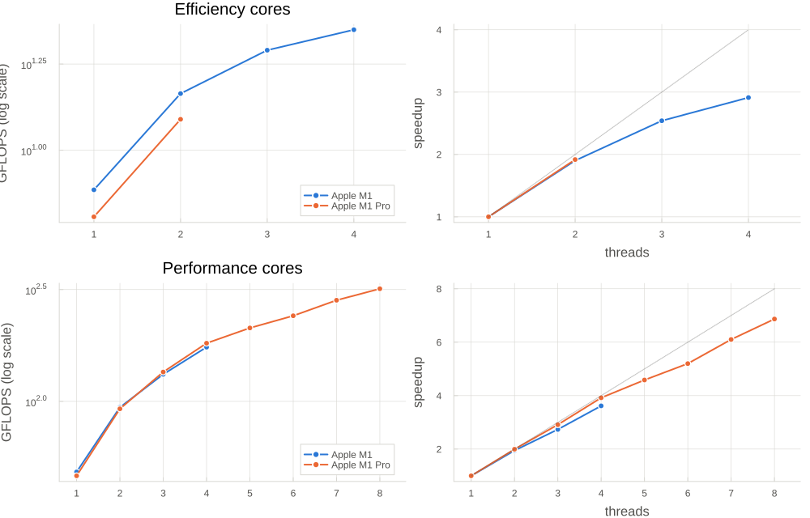

# OpenBLAS DGEMM on Apple Silicon: P-cores vs E-cores (and Super-cores on M5+)

Measures how well OpenBLAS DGEMM scales on each performance tier of Apple M-series
chips. Supports any number of heterogeneous core levels (M1–M4: 2 levels; M6: 3
levels) and enables side-by-side comparison across different chip generations.

# Current Results



## Core Placement Mechanism

macOS exposes no thread-affinity API, so threads cannot be pinned to a specific
cluster directly. The available handle is **QoS class**: threads at background
QoS are confined by the scheduler to the efficiency cluster, while normal-QoS
threads are placed on the performance cluster first and only spill onto E-cores
once the P-cores are saturated.

Each measurement point runs in a **fresh process** (its own OpenBLAS thread pool,
with both `OPENBLAS_NUM_THREADS` and `BLAS.set_num_threads` set), so no leftover
threads from a previous point interfere.

| Mode | Launch | Core Placement |
|---|---|---|
| `super` (M5+) | `julia ...` (Super thread count) | Super cluster only, normal QoS |
| `performance` | `julia ...` (8 threads max) | Performance cluster only, normal QoS |
| `efficiency` | `taskpolicy -b julia ...` (2 threads max) | Efficiency cluster only, background QoS |

## Usage

```bash
# Quick sweep on this chip
julia --project=. driver.jl

# Full sweep with custom parameters
julia --project=. driver.jl --n=4096 --trials=9

# Get results from another machine, then collate
julia --project=. driver.jl --out=results-m1pro.csv
# (on another Mac)
julia --project=. driver.jl --out=results-m6max.csv

# Compare across chips
julia --project=. collate_results.jl results-m1pro.csv results-m6max.csv

# Filter collation by level
julia --project=. collate_results.jl results-*.csv --level=Performance
```

### Options

**driver.jl:**
- `--n=2048` — DGEMM matrix dimension (default: 2048)
- `--trials=5` — timed DGEMM calls per measurement (default: 5)
- `--out=results.csv` — where to write results (default: results.csv)
- `--no-plot` — skip the plotting step

**collate_results.jl:**
- `--out=base` — output filename base (default: dgemm_collated)
- `--level=LEVEL` — filter to one level only (Super, Performance, Efficiency)

### Files

| File | Purpose |
|---|---|
| `driver.jl` | Orchestrates the sweep; discovers topology, generates modes, launches workers |
| `bench_worker.jl` | One measurement point: times DGEMM, outputs CSV row |
| `plot_results.jl` | Single-chip results: throughput + speedup vs 1 thread |
| `collate_results.jl` | Multi-chip collation: side-by-side comparison plots |
| `results.csv` | Output from driver.jl |
| `dgemm_cores.png` / `.svg` | Single-chip plot |
| `dgemm_collated_by_chip.png` / `.svg` | Multi-chip comparison |

## Results: Apple M1 Pro (8P + 2E), n = 2048×2048

| Threads | P-cores | E-cores |
|--:|--:|--:|
| 1 | 46.4 | 6.4 |
| 2 | 92.6 | 12.3 |
| 4 | 182.0 | — |
| 6 | 241.5 | — |
| 8 | **319.0** | — |

**Key observations:**

1. **P-core is ~7.2× an E-core** at 1 thread (46.4 vs 6.4 GFLOPS single-threaded);
   peak E-cluster is only 12.3 GFLOPS (3.8% of peak machine throughput).

2. **Performance cores scale linearly** up to 8 threads: 6.9× speedup from 1→8
   threads on 8 cores (nearly perfect scaling).

3. **Efficiency cores plateau at 2 threads** with 1.9× speedup — bandwidth and
   frequency constraints of the E-cluster limit parallelism.

**Takeaway:** For BLAS workloads, cap threads at `hw.perflevel0.logicalcpu`
(the P-core count). The E-cores are valuable for background tasks but
ineffective for fork-join compute kernels.

## Multi-Chip Comparison

The collation script compares results across architectures by overlaying
throughput curves for each mode and level, enabling:

- **Architecture comparison**: How do M1 Pro, M1 Max, M6, M6 Pro, M6 Max differ
  in real DGEMM performance?
- **Core-type efficiency**: Does M5's Performance tier deliver better
  throughput than M1's P-cores?
- **Scaling patterns**: Do all Apple chips have the same cliff at the P-core
  saturation point?

Run results from multiple machines through `collate_results.jl` to visualize
these patterns.

## Design Notes

**Why fresh processes for each measurement?** OpenBLAS caches thread state and
idle workers persist between GEMM calls. Launching a new Julia process ensures
each measurement gets a clean thread pool. This is especially important under
background QoS (E-cores), where thread creation overhead is much higher.

**Why CSV output?** CSV is portable and unambiguous, making results shareable
and diffable. It also decouples measurement from plotting so you can re-plot
with different parameters without re-measuring.

**Why QoS, not thread affinity?** macOS has no public thread-affinity API (no
CPU_SET equivalent). QoS is the documented way to hint core placement, and
background QoS reliably confines threads to the efficiency cluster. It's not
perfect (on M5+ you can't isolate the Performance tier), but it's what's available.

**Why multiple trials?** DGEMM performance varies slightly due to cache effects,
frequency scaling, and thermal throttling. We report the best trial (peak
throughput) and median (typical performance), discarding outliers.
